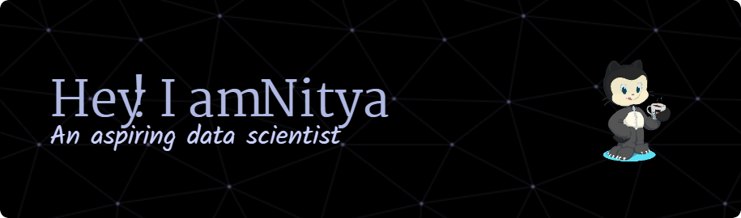

  

 

 
 🔭 I’m currently working on **a Startup dashboard and a Calculator app**
 
 🌱 I’m currently learning **Streamlit and tkinter**

 
 

 

 
<h2 Connect with me on </h1>
  
  <a href="https://www.linkedin.com/in/nitya-verma-832014275/" target="_blank">
    
  
   
  
  

 

 
<h2 align="center"&font=IBM+plex+serif>⚒️ Languages-Frameworks-Tools ⚒️</h2>
 

    

 

  <h2>🐍 My Contributions 🐍</h2>
   
  
  
     

<h2 align="center">⚡ Stats ⚡</h2>
 

  

  

<h3 align="center">
     
</h3>

 
